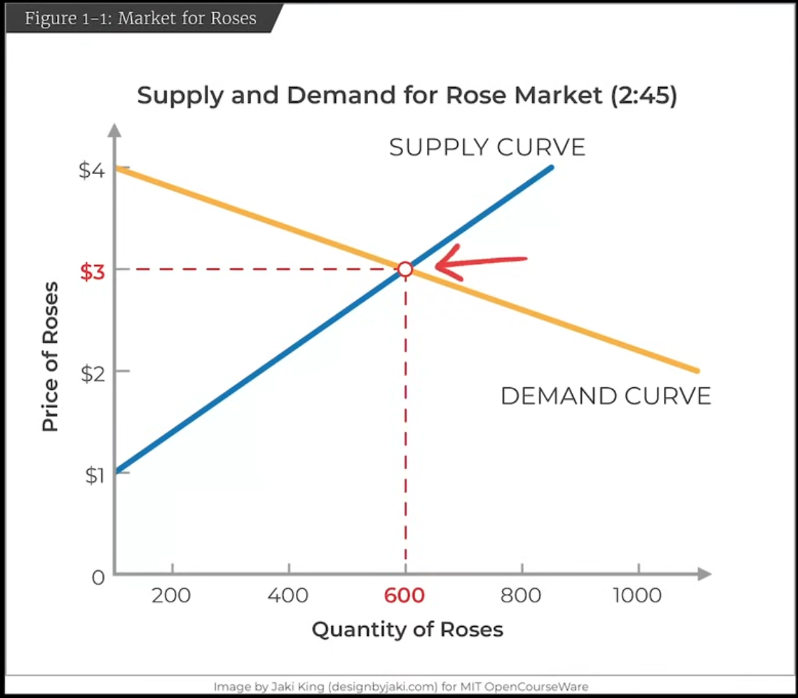

# L01: Introduction and Supply & Demand

**日期**：2026-03-31（回顾）
**视频**：https://www.youtube.com/watch?v=_OkTw766oCs
**状态**：[x] 已看

---

## 核心问题

> 价格机制是如何协调供需的？

---

## 关键图形

### NotebookLM Infographic


### 供需图（视频截图）
[▶ 视频跳转（14:09）](https://youtu.be/_OkTw766oCs?t=849)



> 均衡点：价格 $3，数量 600。供给曲线（蓝，向上倾斜）与需求曲线（橙，向下倾斜）交于此点。

---

## 关键概念

| 概念 | 定义 | 备注 |
|------|------|------|
| 微观经济学 | 研究个人和企业如何在稀缺世界中做出决策；本质是一系列受约束的优化问题 | constrained optimization |
| 机会成本 | 每个行动的成本 = 你放弃的下一个最佳替代方案 | 天下没有免费的午餐 |
| 实证分析 vs 规范分析 | 实证：事物客观上是什么样；规范：事物应该是什么样 | 必须先实证，再规范 |
| 需求曲线 | 向下倾斜：价格越高，需求量越少 | X轴=数量，Y轴=价格 |
| 供给曲线 | 向上倾斜：价格越高，供给量越多 | 利润激励 |
| 均衡价格与均衡数量 | 供需曲线交点：消费者愿买量 = 生产者愿供量 | 市场自动趋向均衡 |

---

## 重要公式 / 模型

```
均衡条件：Qd(P) = Qs(P)
需求价格弹性：ε = (ΔQ/Q) / (ΔP/P)
```

---

## 直觉理解

供需模型像一个自动寻优系统：价格是"信号"，供给和需求是两个"梯度方向"，均衡点就是系统收敛的最优解。

类比：均衡 ≈ 梯度下降收敛到的 loss 最小值点；价格信号 ≈ 反向传播的梯度。

---

## 现实应用

- **水与钻石悖论**：价格反映的是**边际效用**，而非总效用——这是理解该悖论的关键

  | | 总效用 | 边际效用 | 价格 |
  |--|--|--|--|
  | 水 | 极高（生命必需） | 极低（已消费大量，递减到底） | 低 |
  | 钻石 | 较低 | 极高（拥有极少，递减还没开始） | 高 |

  亚当·斯密的错误：把水的高**总效用**误等同于高价格。正确逻辑：供给丰富 → 消费量大 → 边际效用递减 → 愿意支付的价格低。

- **"看不见的手"**：个体自利行为通过价格机制转化为社会最优（最大剩余）
- 价格上限（如房租管制）→ 需求 > 供给 → 短缺；价格下限（如最低工资）→ 供给 > 需求 → 过剩

---

## NotebookLM 问答记录

**Q**：这节课最重要的3个概念及关键图形？
**A**：
1. **微观经济学本质**：受约束的优化练习，权衡取舍
2. **机会成本**：放弃的下一个最佳替代方案，任何决定都有代价
3. **实证 vs 规范**：先建立客观框架，再讨论政策结论

关键图形：供需图（X=数量，Y=价格）。需求曲线向下倾斜，供给曲线向上倾斜，交点为均衡。水与钻石悖论说明必须同时考虑供给和需求两侧。

---

## 练习题

**题 1**：
某城市出台房租上限政策，将月租金上限定为市场均衡价格的80%。请用供需图分析：会出现什么结果？谁受益，谁受损？

**解**：
价格上限 < 均衡价格 → Qd > Qs → 住房短缺。租客（已租到房的）受益；房东受损；找不到房的新租客受损。还会产生黑市、房屋质量下降等副作用。

---

## 思想史背景：劳动价值论与边际革命

### 亚当·斯密的劳动价值论（1776）

斯密认为商品价值由生产所需的劳动量决定。这个框架能解释大多数日常商品（挖钻石比打水费力，所以钻石贵），但有一个**致命反例**：

**稀缺古董、名画、绝版酒**——一幅梵高的画，劳动成本接近零，但价值数亿。"稀缺性本身创造价值"这件事，劳动价值论完全无法解释。

斯密因此将价值拆成两个无法统一的概念，困惑悬而未决了将近100年：
- **使用价值**：对生活的有用程度（水极高）
- **交换价值**：市场上能换到的东西（水极低）

### 马克思的继承与改造

马克思直接继承了斯密的劳动价值论，但做了关键改造：

| | 亚当·斯密 | 马克思 |
|--|--|--|
| 核心概念 | 劳动量决定价值 | **社会必要劳动时间**决定价值 |
| 目的 | 解释市场价格来源（实证） | 揭示资本主义剥削机制（批判） |

马克思加入"社会必要"四个字，堵住了斯密的漏洞（懒工人做的椅子不应该更值钱），然后用这个工具推导出**剩余价值理论**：工人被资本家无偿占有了超出维持自身生存所需的那部分劳动——这就是剥削的来源。

斯密用劳动价值论描述市场，马克思用它解剖市场的权力结构。工具相似，问题意识完全不同。

### 边际革命（1871-1874）：统一的解决方案

三位经济学家在互不知情的情况下几乎同时提出边际效用理论：

| 人物 | 国家 | 著作 |
|------|------|------|
| 威廉·杰文斯 (Jevons) | 英国 | 《政治经济学理论》1871 |
| 卡尔·门格尔 (Menger) | 奥地利 | 《国民经济学原理》1871 |
| 莱昂·瓦尔拉斯 (Walras) | 法国/瑞士 | 《纯粹经济学要义》1874 |

核心洞见：**价格由边际效用决定，不是总效用，也不是劳动量。** 这一框架统一解释了水、钻石和梵高的画——现代主流微观经济学由此奠基，劳动价值论退出了主流。

---

## 遗留问题 / 待深入

- [ ] 弹性的计算：点弹性 vs 弧弹性的区别
- [ ] 供给弹性如何影响税收归宿（tax incidence）
